# Megatron Parallel Training Inclusion Analysis

## Scope

Compare:
- `8a6f5ac` — **"megatron 5D parallelism: MCore init"**
- `1f4a99e` — **merge PR #50 (clip norm & bugfix)**

Question: how Megatron parallel training is being included, and what to do next.

---

## Executive Conclusion

Megatron parallel training is included in this branch through the **`verl_rl` RL training path**, not through the `pretrain` path touched by `1f4a99e`.

In `8a6f5ac`, inclusion happens via three concrete layers:
1. **Launch/config wiring** (`run_grpo.sh`): switches strategy to `megatron`, exposes TP/PP/CP/EP, computes DP, and passes Megatron overrides.
2. **Topology validation** (`onerec_ray_trainer.py` + new helper): validates `world_size % (TP*PP*CP*EP) == 0` and computes DP consistently.
3. **Runtime model-parallel init** (`megatron_workers.py` + `engine/megatron/*`): centralizes MCore init (`initialize_model_parallel`) and applies it for actor/ref/critic/reward roles.

By contrast, `1f4a99e` only changes `pretrain/*` scripts and gradient clipping behavior (`max_grad_norm`) and does not wire or modify Megatron 5D RL initialization.

---

## What Changed in `8a6f5ac` (Megatron 5D)

### 1) Entry/launch path now explicitly enables Megatron in OneRec GRPO

File: `verl_rl/recipe/onerec/run_grpo.sh`

Key inclusion changes:
- Adds explicit parallel factors:
  - `TP_SIZE`, `PP_SIZE`, `CP_SIZE`, `EP_SIZE`
- Computes:
  - `WORLD_SIZE = N_NODES * N_GPUS`
  - `MODEL_PARALLEL_SIZE = TP * PP * CP * EP`
  - `DP_SIZE = WORLD_SIZE / MODEL_PARALLEL_SIZE`
- Fails early if divisibility is invalid.
- Uses `--config-name ppo_megatron_trainer`.
- Forces RL components to Megatron:
  - `actor_rollout_ref.actor.strategy=megatron`
  - `actor_rollout_ref.ref.strategy=megatron`
  - `critic.strategy=megatron`
  - `reward_model.strategy=megatron`
- Injects Megatron overrides for actor/ref TP/PP/CP/EP and sequence parallel.

Interpretation: this commit makes Megatron inclusion explicit and operator-facing in the GRPO launcher.

### 2) Trainer-level topology checks upgraded to 5D formula

File: `verl_rl/recipe/onerec/onerec_ray_trainer.py`

Validation changed from partial logic to full:
- Old style: mostly TP*PP plus separate CP handling.
- New style: `model_parallel_size = TP * PP * CP * EP`.
- Enforces `n_gpus % model_parallel_size == 0`.
- Derives `megatron_dp = n_gpus // model_parallel_size`.
- Uses derived DP for minimal batch-size sanity.
- Prints a 5D topology summary line for debugging.

Interpretation: this is the control-plane guardrail preventing invalid cluster/parallel settings before heavy training starts.

### 3) MCore init centralized and reused across worker roles

New file: `verl_rl/verl/workers/engine/megatron/transformer_impl.py`

Introduced helper API:
- `get_parallelism_tuple()`
- `validate_parallelism()`
- `initialize_megatron_model_parallel()`
- `summarize_parallelism_state()`

Behavior:
- Single source of truth for TP/PP/CP/EP checks and DP derivation.
- Initializes Megatron core parallel groups once (skip if already initialized).
- Supports optional `dynamic_context_parallel` with signature check.

Integration updates:
- `verl_rl/verl/workers/megatron_workers.py` now calls helper functions instead of directly inlining `mpu.initialize_model_parallel(...)` in actor/ref/critic/reward setup.
- `verl_rl/verl/workers/engine/megatron/engine_impl.py` no longer placeholder-only:
  - initializes torch distributed if needed
  - validates topology
  - initializes Megatron model-parallel groups
  - logs TP/PP/CP/DP runtime state
- `verl_rl/verl/workers/engine/__init__.py` exports `MegatronEngine`.

Interpretation: inclusion is not only "enabled" by config; it is also structurally integrated through shared initialization primitives.

---

## What `1f4a99e` Does (and Does Not Do)

`1f4a99e` is a merge commit for PR #50 (child commit `c1f67b7`):
- Adds `--max_grad_norm` in `pretrain/examples/*.sh`.
- Adds `clip_grad_norm()` utility in `pretrain/onerec_llm/training/gradients.py`.
- Switches `train_qwen3.py` gradient clipping path from value clipping to norm clipping.
- Fixes resume behavior when `resume_training_state` is false.

It does **not**:
- touch `verl_rl/recipe/onerec/*`,
- touch `verl_rl/verl/workers/megatron_workers.py`,
- touch `verl_rl/verl/workers/engine/megatron/*`,
- introduce 5D topology logic in RL path.

Interpretation: PR #50 is a **pretrain optimization/bugfix track**, while `8a6f5ac` is a **verl_rl Megatron 5D integration track**.

---

## Inclusion Path (End-to-End)

The Megatron parallel training path now looks like:

1. Operator launches `verl_rl/recipe/onerec/run_grpo.sh`
2. Script sets TP/PP/CP/EP and derives DP (with divisibility checks)
3. Hydra config uses `ppo_megatron_trainer` and Megatron strategies
4. `RayPPOTrainer._validate_config()` re-checks 5D constraints at trainer level
5. Worker startup (`ActorRolloutRefWorker`, `CriticWorker`, `RewardModelWorker`) calls centralized helper:
   - validate topology
   - initialize Megatron model parallel
   - print runtime group/rank summary
6. Megatron-based actor/ref/critic/reward training runs with consistent parallel state

This is how Megatron parallel training is being included in practice for this branch.

---

## Current Gaps / Risks

1. **Config asymmetry risk**  
   In `run_grpo.sh`, Megatron overrides are explicit for actor/ref; critic/reward rely more on inherited config defaults. If defaults drift, topology mismatch can occur.

2. **Engine shim incomplete for train/infer**  
   `MegatronEngine` initializes parallel groups but still raises `NotImplementedError` in `train_batch`/`infer_batch`. Current production path still depends on legacy `megatron_workers`.

3. **No explicit automated topology matrix tests**  
   There is runtime assert-based protection, but no clear CI/e2e matrix covering representative TP/PP/CP/EP combinations.

4. **Potential rollout/train parallel mismatch complexity**  
   `rollout.tensor_model_parallel_size` can diverge from train TP. Logged currently, but policy/validation for acceptable mismatch is still soft.

---

## Megatron `use_mbridge=True` for OneRec Arch.

Current OneRec Megatron RL call stack in `verl_rl` (`use_mbridge=True`) is:

1. Launcher: `recipe/onerec/run_grpo.sh` -> `python -m recipe.onerec.main_onerec_ppo`.
2. Driver: `OneRecTaskRunner.run()` builds worker mapping and creates `RayPPOTrainer`.
3. Worker bootstrap: `RayPPOTrainer.init_workers()` -> `NVMegatronRayWorkerGroup` -> worker `init_model()`.
4. Megatron model init path: `MegatronWorker._init_hf_config_and_tf_config(..., use_mbridge=True)` -> `AutoBridge.from_config(...)` -> `bridge.get_model/load_weights`.
5. Rollout path:
   - Sync two-stage OneRec: `OneRecMegatronActorRolloutRefWorker._build_rollout()` -> `OneRecvLLMRollout` + `MegatronVLLMShardingManager(bridge=self.bridge)`.
   - Async path (non-two-stage Megatron): `AsyncActorRolloutRefWorker` + `AgentLoopManager` + async LLM server actors.
6. Training loop (`RayPPOTrainer.fit()`): generate -> reward manager / RM worker -> log-prob/ref/value -> advantage -> critic/actor update.

```mermaid
flowchart TD
    A["run_grpo.sh<br/>main_onerec_ppo"] --> B["OneRecTaskRunner.run()"]
    B --> C["Build role_worker_mapping<br/>Megatron strategy"]
    C --> D["RayPPOTrainer(...)"]
    D --> E["init_workers()"]

    E --> F["NVMegatronRayWorkerGroup<br/>spawn colocated workers"]
    F --> G["Actor/Critic/Ref/RM init_model()"]

    G --> H["MegatronWorker._init_hf_config_and_tf_config(..., use_mbridge=True)"]
    H --> I["AutoBridge.from_config(hf_config)<br/>bridge=configured"]
    I --> J["bridge.get_model(...)"]
    I --> K["bridge.load_weights(...)"]

    G --> L{"rollout.name"}
    L -->|two_stage + sync| M["OneRecMegatronActorRolloutRefWorker._build_rollout()"]
    M --> N["OneRecvLLMRollout<br/>(stage1 generate + stage2 beam_search)"]
    M --> O["MegatronVLLMShardingManager<br/>bridge.export_weights()"]

    L -->|vllm/sglang async| P["AsyncActorRolloutRefWorker"]
    P --> Q["AgentLoopManager"]
    Q --> R["async_llm_server_* actors + AgentLoopWorker"]

    D --> S["fit() training loop"]
    S --> T["Generate sequences<br/>(WG or AgentLoopManager)"]
    T --> U["Reward path<br/>reward_fn / rm_wg.compute_rm_score"]
    U --> V["compute_log_prob + compute_ref_log_prob + compute_values"]
    V --> W["compute_advantage"]
    W --> X["critic_wg.update_critic (if enabled)"]
    X --> Y["actor_rollout_wg.update_actor"]
```

---

## Possible Future Plan

### Phase 1: Hardening (short-term)
- Add a small validation utility/test matrix for `(TP, PP, CP, EP, WORLD_SIZE) -> DP` expectations.
- Enforce critic/reward Megatron parallel overrides explicitly in launcher (or validate they match actor/ref defaults).
- Add one concise "effective topology" printout in all roles with identical format for easier debugging.

### Phase 2: Reliability (mid-term)
- Add e2e smoke jobs for 2-3 topologies (e.g., `2x2x1x1`, `4x1x1x1`, `2x1x2x1`) in CI/nightly.
- Add fail-fast checks for rollout/training TP mismatch when unsupported combinations are set.
- Add regression coverage for re-init behavior when workers are colocated.

### Phase 3: Architecture convergence (long-term)
- Complete `MegatronEngine.train_batch` and `infer_batch` so engine path can replace legacy worker-only logic.
- Gradually migrate role-specific startup to engine abstraction while keeping helper module as shared source of truth.
- Add checkpoint/load support parity in `MegatronEngine` for full production readiness.

### Phase 4: Performance follow-up
- Profile communication cost by topology (esp. CP/EP) and define recommended presets by model scale.
- Add optional topology auto-suggestion given `world_size` and model config constraints.

---

## Bottom Line

Relative to `1f4a99e`, Megatron is included by `8a6f5ac` through explicit RL launcher wiring + 5D topology validation + centralized MCore initialization reuse across worker roles.  
`1f4a99e` is orthogonal (pretrain clipping/resume improvements) and does not contribute to Megatron 5D RL inclusion.
