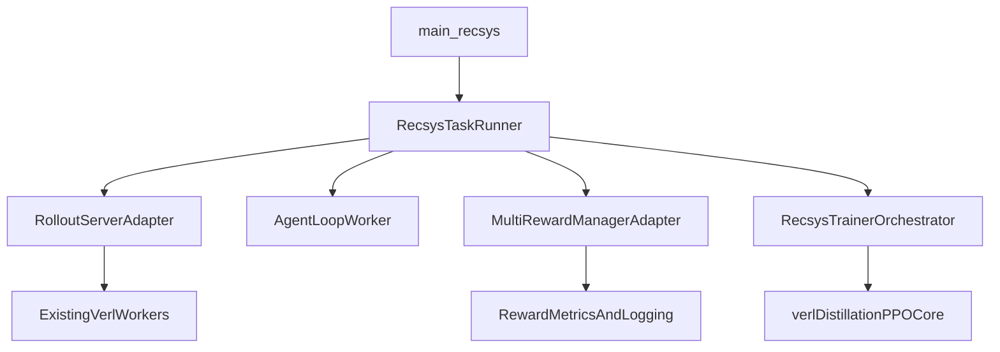

# Build `verl-recsys` with Runtime-Slim Cleanup

## Scope and Strategy

- Apply **runtime-slim** cleanup to both trees: keep production training/runtime paths; remove docs/examples/tests/auxiliary scripts and unused variants.
- Use **hybrid base**: keep `verl_distillation` as the execution backbone, selectively port useful logic from `verl_rl`.
- Create a new `verl-recsys` layer that composes rollout server, agent loop worker, reward manager, and trainer orchestration.

## Current Anchors to Reuse

- Distillation entrypoint and task orchestration in `[/Users/frederickhong/fred_code/vllm_ge_dev/vllm_gr_v2_fred_fork/openonerec_fred_workingbranch/output/fredfork/verl_distillation/recipe/onpolicy_distill/main_onpolicy_distill.py](/Users/frederickhong/fred_code/vllm_ge_dev/vllm_gr_v2_fred_fork/openonerec_fred_workingbranch/output/fredfork/verl_distillation/recipe/onpolicy_distill/main_onpolicy_distill.py)` and `[/Users/frederickhong/fred_code/vllm_ge_dev/vllm_gr_v2_fred_fork/openonerec_fred_workingbranch/output/fredfork/verl_distillation/recipe/onpolicy_distill/onpolicy_distill_trainer.py](/Users/frederickhong/fred_code/vllm_ge_dev/vllm_gr_v2_fred_fork/openonerec_fred_workingbranch/output/fredfork/verl_distillation/recipe/onpolicy_distill/onpolicy_distill_trainer.py)`.
- Core PPO runtime wiring in `[/Users/frederickhong/fred_code/vllm_ge_dev/vllm_gr_v2_fred_fork/openonerec_fred_workingbranch/output/fredfork/verl_distillation/verl/trainer/main_ppo.py](/Users/frederickhong/fred_code/vllm_ge_dev/vllm_gr_v2_fred_fork/openonerec_fred_workingbranch/output/fredfork/verl_distillation/verl/trainer/main_ppo.py)`.
- Existing multi-reward implementation in `[/Users/frederickhong/fred_code/vllm_ge_dev/vllm_gr_v2_fred_fork/openonerec_fred_workingbranch/output/fredfork/multireward_mgr_support/reward_manager/multi_reward_manager.py](/Users/frederickhong/fred_code/vllm_ge_dev/vllm_gr_v2_fred_fork/openonerec_fred_workingbranch/output/fredfork/multireward_mgr_support/reward_manager/multi_reward_manager.py)` and registration in `[/Users/frederickhong/fred_code/vllm_ge_dev/vllm_gr_v2_fred_fork/openonerec_fred_workingbranch/output/fredfork/multireward_mgr_support/reward_manager/register_multi.py](/Users/frederickhong/fred_code/vllm_ge_dev/vllm_gr_v2_fred_fork/openonerec_fred_workingbranch/output/fredfork/multireward_mgr_support/reward_manager/register_multi.py)`.
- Candidate `verl_rl` logic to evaluate/port only if needed: enhanced PPO cluster in `[/Users/frederickhong/fred_code/vllm_ge_dev/vllm_gr_v2_fred_fork/openonerec_fred_workingbranch/output/fredfork/verl_rl/verl/trainer/main_ppo_enhanced.py](/Users/frederickhong/fred_code/vllm_ge_dev/vllm_gr_v2_fred_fork/openonerec_fred_workingbranch/output/fredfork/verl_rl/verl/trainer/main_ppo_enhanced.py)`.

## Runtime-Slim Cleanup Plan

1. Build an explicit runtime allowlist for both trees (entrypoints, required `verl/**` runtime modules, required recipe/config).
2. Remove non-runtime directories from both trees:
  - `docs/`, `examples/`, `tests/`, `docker/`, and non-essential `scripts/`.
3. In `verl_distillation/recipe`, keep only `onpolicy_distill` for runtime-slim scope; remove other recipes.
4. In `verl_rl`, remove high-confidence dead custom files first (notably `algorithm_enhanced.py` and unused enhanced-only wiring if not selected for porting).
5. Update packaging manifests to match slim runtime footprint:
  - `[/Users/frederickhong/fred_code/vllm_ge_dev/vllm_gr_v2_fred_fork/openonerec_fred_workingbranch/output/fredfork/verl_distillation/pyproject.toml](/Users/frederickhong/fred_code/vllm_ge_dev/vllm_gr_v2_fred_fork/openonerec_fred_workingbranch/output/fredfork/verl_distillation/pyproject.toml)`
  - `[/Users/frederickhong/fred_code/vllm_ge_dev/vllm_gr_v2_fred_fork/openonerec_fred_workingbranch/output/fredfork/verl_rl/pyproject.toml](/Users/frederickhong/fred_code/vllm_ge_dev/vllm_gr_v2_fred_fork/openonerec_fred_workingbranch/output/fredfork/verl_rl/pyproject.toml)`

## `verl-recsys` Framework Design

- Add a new package namespace under repository root: `verl_recsys/`.
- Define stable module boundaries:
  - `verl_recsys/rollout/server.py` (rollout server abstraction + backend adapters)
  - `verl_recsys/agent/loop_worker.py` (agent loop worker lifecycle and task loop)
  - `verl_recsys/reward/manager.py` (multi-reward manager adapter and registry bootstrap)
  - `verl_recsys/trainer/recsys_trainer.py` (training loop orchestration over existing RayPPO/RayOnPolicyDistill flow)
  - `verl_recsys/config/` (Hydra schema overlays for recsys defaults)
  - `verl_recsys/main_recsys.py` (single entrypoint)
- Wire `main_recsys.py` to reuse `TaskRunner/run_ppo` execution model from `verl_distillation` while routing reward management through multi-reward registration.
- Keep backend compatibility hooks (`fsdp`, `megatron`, `vllm`, async rollout) delegated to existing `verl` worker implementations to minimize migration risk.

## VeRL 26Q1 Roadmap Alignment

- Source reference: `[[roadmap] verl 26Q1 roadmap](https://github.com/verl-project/verl/issues/4880)`.
- Include in `verl-recsys` now:
  - model engine switch contract (`new` default, legacy fallback)
  - rollout server profiling and backend abstraction surface
  - router replay configuration pass-through
  - agent-loop multi-output handling hooks
  - checkpoint engine abstraction/manager layer
  - on-policy distillation and multi-teacher config entrypoint
  - transfer queue and async trainer readiness flags
- Exclude for now (out of immediate scope): full TensorRT-LLM backend implementation, full VeOmni/TorchTitan integrations, and deep Megatron performance rewrites.

## Target Runtime Flow

## Migration Rules

- Prefer compose-over-fork: import and wrap existing `verl_distillation` modules first; copy code from `verl_rl` only when a feature gap is proven.
- Port only selected logic from enhanced files (`rollout correction`, `reward shaping`) behind feature flags in `verl_recsys/config`.
- Preserve one runtime entrypoint path for training jobs (`python -m verl_recsys.main_recsys`) to avoid ambiguity between two `verl` trees.

## Verification Gates

- Import/runtime smoke tests:
  - `python -m verl_recsys.main_recsys --help`
  - dry-run config resolve for recsys config.
- Minimal training loop sanity run with tiny sample data.
- Confirm removed files are not referenced by remaining code paths.
- Confirm reward manager registry resolves `multi` in recsys entrypoint path.

